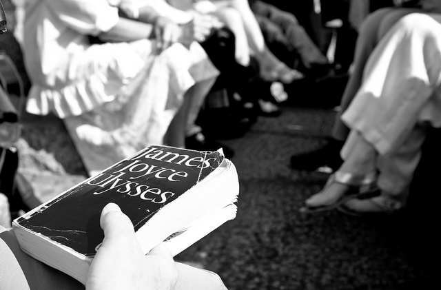
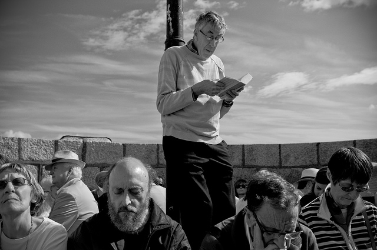

For each of the five years we’ve been in Dublin, we’ve talked about attending one of the [Bloomsday](http://en.wikipedia.org/wiki/Bloomsday) activities that happen every June 16, but always found an excuse not to do so. Deciding that this year is our last in Ireland was the kick in the pants we needed to actually do something this year.

Early this morning we headed for Forty Foot at Sandycove and the [Martello tower](http://www.dun-laoghaire.com/profile/joyce_tower/index.html) that Joyce used as the backdrop for the opening scenes from Ulysses. 40 of us climbed the tiny spiral stairs to the top of the tower and crammed in to listen to Irish actor Barry McGovern give his annual reading. While some followed along in their own copies of the book – all seemingly tattered, abused, bookmarked – others just closed their eyes and meditated on McGovern’s theatre voice, Joyce’s words, Molly Bloom’s bawdy stream of consciousness and the surprisingly harsh morning sun.

